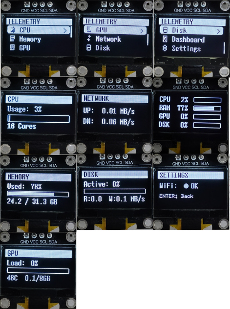

# ESP32 OLED Telemetry Monitor

A real-time laptop telemetry monitoring system using an ESP32-S3 microcontroller and a 0.96" OLED display (128x64). Displays CPU, RAM, GPU, Network, and Disk statistics.

## Demo




## Features

- **Real-time Monitoring**: CPU usage, RAM usage, GPU load & temperature, Network speeds, Disk activity
- **Clean UI**: Simple menu interface for easy navigation
- **Dashboard View**: Quick overview of all system stats in one screen
- **Responsive Buttons**: Hardware interrupt-driven button handling for instant response

## Hardware Requirements

- **ESP32-S3 DevKitM-1** (or compatible ESP32 board)
- **0.96" OLED Display** (128x64, SSD1306, I2C)
- **3x Push Buttons** (momentary, normally open)

> **Note:** This project was built using ESP32-S3. If you're using a different ESP32 board, modify the `platformio.ini` file to match your board.

### Pin Configuration

| Component | GPIO Pin |
|-----------|----------|
| OLED SDA  | GPIO 8   |
| OLED SCL  | GPIO 9   |
| Button UP | GPIO 4   |
| Button DOWN | GPIO 5 |
| Button ENTER | GPIO 6 |

### Wiring Diagram

```
ESP32-S3          OLED Display
--------          ------------
3.3V      ----->  VCC
GND       ----->  GND
GPIO 8    ----->  SDA
GPIO 9    ----->  SCL

ESP32-S3          Buttons (Active LOW)
--------          -------------------
GPIO 4    ----->  UP Button    ----> GND
GPIO 5    ----->  DOWN Button  ----> GND
GPIO 6    ----->  ENTER Button ----> GND
```

*Note: Internal pull-up resistors are used, so buttons connect directly to GND.*

## Software Requirements

### ESP32 Firmware
- PlatformIO
- Create a new project with **Arduino framework** for **ESP32**

### Python Server (runs on laptop)
- Python 3.8+
- Required packages:
  ```
  pip install psutil GPUtil
  ```

## Installation

### 1. Flash ESP32 Firmware

1. Clone this repository
2. Open the project in PlatformIO
3. If using a different ESP32 board, update `platformio.ini`:
   ```ini
   [env:your-board]
   platform = espressif32
   board = your-board-name
   framework = arduino
   ```
4. Update WiFi credentials in `include/config.h`:
   ```cpp
   #define WIFI_SSID           "your-wifi-ssid"
   #define WIFI_PASSWORD       "your-wifi-password"
   #define TELEMETRY_HOST      "your-laptop-ip"
   ```
5. Build and upload:
   - Click the **→** (Upload) arrow in PlatformIO toolbar, OR
   - Run in terminal:
     ```
     pio run -t upload
     ```

### 2. Run Python Telemetry Server

1. Find your laptop's IP address:
   ```
   ipconfig  (Windows)
   ```
2. Update `TELEMETRY_HOST` in `config.h` with this IP
3. Run the server:
   ```
   python telemetry_server.py
   ```
4. The server will start on port 5000

## Usage

### Navigation
- **UP/DOWN**: Navigate menu items
- **ENTER (short press)**: Select item / Go back from sub-screen
- **ENTER (long press)**: Go back to main menu

> **Note:** The button handling is not fully polished. UP/DOWN buttons need to be pressed quickly for single steps, otherwise they may scroll twice. ENTER requires a slightly longer press to register. It works, but could use improvement.

### Menu Screens
1. **CPU** - Usage percentage, core count
2. **Memory** - RAM usage and capacity
3. **GPU** - Load, temperature, VRAM usage
4. **Network** - Upload/download speeds
5. **Disk** - Active time, read/write speeds
6. **Dashboard** - All stats at a glance
7. **Settings** - WiFi status

## Project Structure

```
.96 Oled Menu/
├── include/
│   ├── config.h        # Pin definitions, WiFi settings
│   ├── buttons.h       # Button handler with interrupts
│   ├── menu.h          # Menu system and UI rendering
│   ├── telemetry.h     # Telemetry data structures
│   └── icons.h         # Menu icons (XBM format)
├── src/
│   └── main.cpp        # Main application code
├── telemetry_server.py # Python server for laptop
└── platformio.ini      # PlatformIO configuration
```

## Configuration

### WiFi Settings (`config.h`)
```cpp
#define WIFI_SSID           "your-ssid"
#define WIFI_PASSWORD       "your-password"
#define TELEMETRY_HOST      "192.168.x.x"
#define TELEMETRY_PORT      5000
```

### Timing Settings
```cpp
#define DATA_REFRESH_MS     2000    // Fetch data every 2 seconds
#define MENU_ANIMATION_MS   16      // ~60fps rendering
```

## Dependencies

### PlatformIO Libraries
- `olikraus/U8g2` - OLED display driver
- `bblanchon/ArduinoJson` - JSON parsing

### Python Packages
- `psutil` - System monitoring
- `GPUtil` - GPU monitoring (NVIDIA)

## License

MIT License - Feel free to use and modify for your own projects.

## Acknowledgments

- Menu design influenced by [upiir/arduino_oled_menu](https://github.com/upiir/arduino_oled_menu)
